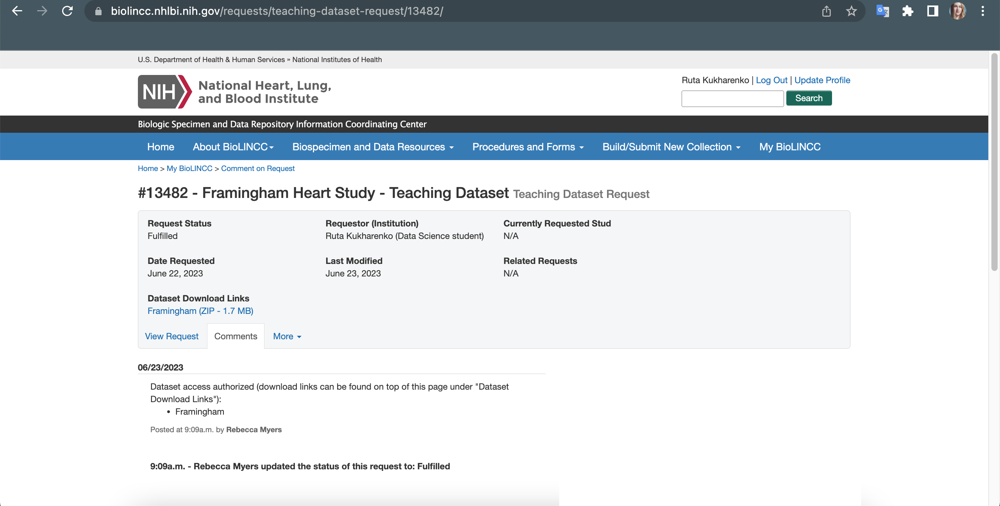

## The Framingham Heart Study

### Introduction

**Data request.** 
The data was requested from the National Heart, Lung and Blood Institute (USA).
The official request and response is in the screenshot below.

**General information.** 
The Framingham Heart Study is a long term prospective study of the etiology of cardiovascular disease among a population of free living subjects in the community of Framingham, Massachusetts.

The Framingham Heart Study was a landmark study in epidemiology in that it was the first prospective study of cardiovascular disease and identified the concept of risk factors and their joint effects. 

The study began in 1948 and 5,209 subjects were initially enrolled in the study. Participants have been examined biennially since the inception of the study and all subjects are continuously followed through regular surveillance for cardiovascular outcomes.

Clinic examination data has included Cardiovascular Disease risk factors and markers of disease such as blood pressure, blood chemistry, lung function, smoking history, health behaviors, ECG tracings, Echocardiography, and medication use. Through regular surveillance of area hospitals, participant contact, and death certificates, the Framingham Heart Study reviews and adjudicates events for the occurrence of Angina Pectoris, Myocardial Infarction, Heart Failure, and Cerebrovascular disease.

The enclosed dataset is a subset of the data collected as part of the Framingham study and includes laboratory, clinic, questionnaire, and adjudicated event data on 4,434 participants.

Participant clinic data was collected during three examination periods, approximately 6 years apart, from roughly 1956 to 1968. 
Each participant was followed for a total of 24 years for the outcome of the following events:
- Angina Pectoris;
- Myocardial Infarction;
- Atherothrombotic;
- Infarction or Cerebral Hemorrhage (Stroke) or death.

**Example.** 
The data is provided in Longitudinal form.
Each participant has 1 to 3 observations depending on the number of exams the subject attended,
and as a result there are 11,627 observations on the 4,434 participants.

Event data for each participant has been added without regard for prevalent disease status or when examination data was collected.

For example, consider the following participant:

| RANDID | age | sex | time | period | prevchd | mi_fchd | timemifc |
|:------:|:---:|:---:|:----:|:------:|:-------:|:-------:|:--------:|
| 95148  | 52  | 2   | 0    | 1      | 0       | 1       | 3607     |
| 95148  | 58  | 2   | 2128 | 2      | 0       | 1       | 3607     |
| 95148  | 64  | 2   | 4192 | 3      | 1       | 1       | 3607     |

Participant 95148 entered the study (time=0 or period=1) free of prevalent coronary heartdisease (prevchd=0 at period=1).

However, during followup, an MI event occurred at day 3607 following the baseline examination.
The MI occurred after the second exam the subject attended (period=2 or time=2128 days), but before the third attended exam (period=3 or time=4192 days).

Since the event occurred prior to the third exam, the subject was prevalent for CHD (prevchd=1) at the third examination.
Note that the event data (mi_fchd, timemifc) covers the entire followup period and does not change according to exam.

**Description of features.** 
[Variables 1](csv/variables_1.csv) 
[Variables 2](csv/variables_1.csv)

For Each participant the following event data is provided. For each type of event, ‘0' indicates
the event did not occur during followup, and ‘1' indicates an event did occur during followup.

Only the first event occurring during the interval of baseline (PERIOD=1) to end of followup is provided.

### Task

Our task is to predict, based on the patient’s data, whether he will develop cardiovascular heart disease and with what probability.
Binary classification.

### Target variable

Target variable - CVD.

### Model evaluation metrics

Basically, we will focus on this metric - ROC-AUC.

**ROC-AUC.** 
The Receiver Operating Characteristic - Area Under the Curve (ROC-AUC) is a widely used metric for evaluating the performance of machine learning models,
particularly in binary classification tasks.
ROC-AUC is less affected by class imbalance, making it suitable for imbalanced datasets. 
$$\text{ROC-AUC} = \int_0^1 \text{TPR}(\text{FPR}^{-1}(t)) \, dt$$

We will also focus on the metrics below: 
**Accuracy.** 
Description: The ratio of correctly predicted instances to the total number of instances in the dataset. 
Formula: (TP + TN) / (TP + TN + FP + FN).

**Precision (Positive Predictive Value).** 
Description: The proportion of true positive predictions among all positive predictions made by the model. 
Formula: TP / (TP + FP).

**Recall (Sensitivity, True Positive Rate).** 
Description: The proportion of true positive predictions among all actual positive instances in the dataset. 
Formula: TP / (TP + FN).

**F1-Score:** 
Description: The harmonic mean of precision and recall, which balances the trade-off between false positives and false negatives. 
Formula: 2 * (Precision * Recall) / (Precision + Recall).
